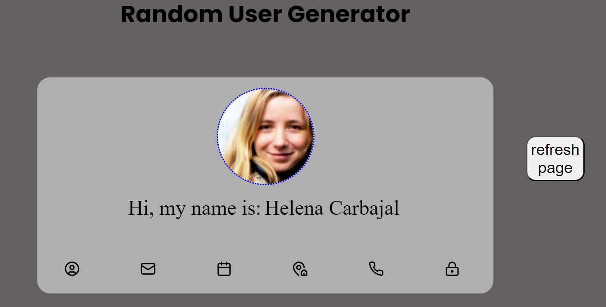

# 🌟 Random User Generator

Bem-vindo ao **Random User Generator**! Este projeto é uma aplicação web simples que consome uma API para gerar e exibir dados aleatórios de usuários. O objetivo é demonstrar como integrar uma API externa para buscar e apresentar informações de maneira interativa.

## 🎯 Objetivo

O principal objetivo deste projeto é mostrar como integrar e utilizar uma API para exibir dados aleatórios de usuários em uma interface web. Utilizamos a [Random User Generator API](https://randomuser.me) para gerar dados fictícios de usuários, incluindo:

- Nome
- E-mail
- Idade
- Endereço
- Telefone
- Senha

## 🌐 API Utilizada

A API utilizada para este projeto é a [Random User Generator API](https://randomuser.me). Ela fornece dados aleatórios de usuários em formato JSON.

### Endpoint da API

### Parâmetros

- **`nat`**: Define a nacionalidade dos usuários. No projeto, são usadas as nacionalidades Brasil (BR), Estados Unidos (US) e Suíça (CH).

## 🚀 Como os Dados São Buscados

1. **Carregamento da Página:**

   - Quando a página é carregada (`DOMContentLoaded`), o JavaScript faz uma requisição para a API usando a função `fetch()`.

2. **Requisição à API:**

   - A função `callAPI()` realiza uma chamada assíncrona para a API e aguarda a resposta.

3. **Processamento da Resposta:**

   - Ao receber a resposta com status 200 (sucesso), os dados do usuário são extraídos do JSON retornado.
   - A imagem, nome, e-mail, idade, endereço, telefone e senha do usuário são exibidos na interface.

4. **Atualização da Interface:**

   - A imagem do usuário é exibida em um elemento `
` com a classe `userPhoto`.
   - As informações do usuário são atualizadas em uma lista `<ul>` com a classe `info`.
   - O nome do usuário é exibido em um parágrafo `
` com a classe `userName`.

5. **Interatividade:**

   - A lista de informações permite que o usuário passe o mouse sobre diferentes itens para exibir detalhes adicionais.

6. **Botão de Atualização:**
   - O botão "refresh page" permite recarregar a página e gerar um novo usuário aleatório.

## 🗂 Estrutura dos Arquivos

- **`index.html`**: Estrutura HTML da página.
- **`styles.css`**: Estilos da página e dos elementos da interface.
- **`index.js`**: Código JavaScript que faz a chamada à API, processa os dados e atualiza a interface.

## 🏁 Como Executar

1. Clone o repositório ou baixe os arquivos para o seu computador.
2. Abra o arquivo `index.html` em um navegador web.
3. A página exibirá um usuário aleatório e suas informações. Clique no botão "refresh page" para gerar um novo usuário.

## 🤝 Contribuições

Sinta-se à vontade para contribuir com melhorias ou correções. Para contribuir:

1. Faça um fork do repositório.
2. Envie um pull request com suas alterações.

## 📜 Licença

Este projeto está licenciado sob a [MIT License](LICENSE).

---

Obrigado por conferir este projeto! Se você tiver alguma dúvida ou sugestão, por favor, entre em contato. 😊
